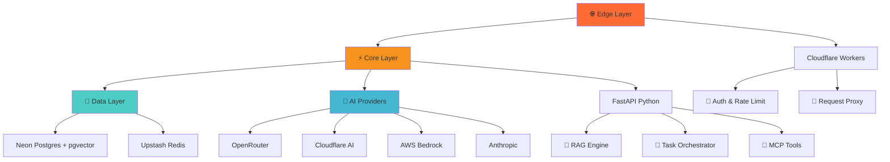

---
AIGC:
    ContentProducer: Minimax Agent AI
    ContentPropagator: Minimax Agent AI
    Label: AIGC
    ProduceID: "00000000000000000000000000000000"
    PropagateID: "00000000000000000000000000000000"
    ReservedCode1: 304402202b5ae49371217ba2d72a6e1f5a12c955d617179f0648191f5ea64b1a98e4925002200ecf6e817249a711f25d53509c047fdd954a21c3853aaaf46a2f7cdbbc13368e
    ReservedCode2: 3046022100eb9b0343beb7dc34dbc4b1368545b8330d44c6311a8ffa764901ee8d55859aa80221008705656cd6ca3106c984411dae6659ae9ccd0ae120090cc3954215341946768c
---

# 🚀 bl1nk-agent-builder

<div align="center">

[](https://github.com/your-org/bl1nk-agent-builder)
[](LICENSE)
[](https://python.org)
[](https://typescriptlang.org)
[](https://fastapi.tiangolo.com)
[](https://workers.cloudflare.com)

**AI Agent Platform with RAG, Multi-Agent Orchestration & Enterprise-Grade Security**

[](https://workers.cloudflare.com)
[](https://docker.com)
[](https://redis.io)

</div>

## ✨ What is bl1nk?

bl1nk is a **next-generation AI agent platform** that combines the power of multiple LLM providers with intelligent routing, RAG capabilities, and enterprise-grade security. Built with a modern edge-first architecture, bl1nk delivers **low-latency responses** while maintaining **cost efficiency** through smart provider selection.

### 🎯 Key Features

- **🧠 Multi-Agent Orchestration** - Coordinate multiple AI agents with intelligent task distribution
- **🔄 Smart Provider Routing** - Automatically route requests to the best-performing LLM provider
- **📚 RAG Integration** - Built-in vector search with pgvector for contextual responses
- **🛡️ Enterprise Security** - End-to-end encryption, audit logging, and compliance features
- **⚡ Edge-First Architecture** - Cloudflare Workers + FastAPI + Serverless databases
- **📊 Real-time Monitoring** - Comprehensive metrics and cost tracking
- **🔌 MCP Integration** - Model Context Protocol support for extended capabilities

## 🏗️ Architecture Overview



## 🚀 Quick Start (Under 5 Minutes!)

### Prerequisites

- **Python 3.11+** 🐍
- **Node.js 18+** (with pnpm) 📦
- **PostgreSQL 15+** (Neon recommended) 🐘
- **Redis** (Upstash serverless) ⚡
- **Git** 📁

### 1. One-Command Setup ⚡

```bash
# Clone and bootstrap in one go
git clone https://github.com/your-org/bl1nk-agent-builder.git
cd bl1nk-agent-builder
./scripts/bootstrap.sh development
```

### 2. Environment Setup 🔧

```bash
# Quick environment setup
cp config/env.example .env

# Generate API keys automatically
./scripts/generate_api_keys.sh

# Validate your setup
./scripts/validate_secrets.sh
```

**🔑 Get Your API Keys:**
- **OpenRouter**: [api.openrouter.ai](https://api.openrouter.ai) → Get free credits! 💰
- **Cloudflare**: [dash.cloudflare.com](https://dash.cloudflare.com) → Workers AI
- **Neon DB**: [neon.tech](https://neon.tech) → Free tier available! 🆓
- **Upstash Redis**: [upstash.com](https://upstash.com) → Serverless Redis

### 3. Launch Services 🚀

```bash
# Start everything with one command
make dev

# Or manually:
# Terminal 1: FastAPI Core
cd apps/worker && uvicorn app.main:app --reload --host 0.0.0.0 --port 8000

# Terminal 2: Cloudflare Edge
cd apps/bridge && wrangler dev

# Terminal 3: Next.js UI (optional)
cd ui/nextjs && pnpm dev
```

### 4. Test Your Setup ✅

```bash
# Health check
curl http://localhost:8000/health

# Test AI integration
curl -X POST http://localhost:8000/api/v1/chat \
  -H "Content-Type: application/json" \
  -d '{"message": "Hello bl1nk!", "model": "anthropic/claude-3-sonnet"}'

# Test RAG functionality
curl -X POST http://localhost:8000/api/v1/rag/query \
  -H "Content-Type: application/json" \
  -d '{"query": "What is machine learning?"}'
```

## 🎮 Interactive Demo

Try bl1nk with our pre-configured examples:

```bash
# Run the demo suite
./scripts/demo.sh

# Test different AI providers
./scripts/test_providers.sh

# Generate sample data for RAG
./scripts/generate_sample_data.sh
```

## 📊 Project Health Dashboard

Real-time project metrics:

```bash
# View project statistics
./scripts/project_stats.sh

# Check dependencies status
./scripts/check_dependencies.sh

# Generate project report
./scripts/generate_report.sh
```

## 🔧 Advanced Configuration

### Provider Routing Rules

Edit `config/provider_routing.yaml`:

```yaml
routing_rules:
  - model_pattern: "gpt-4*"
    provider: "openrouter"
    priority: 1
    fallback: "claude-3-sonnet"
  
  - model_pattern: "claude-3*"
    provider: "anthropic"
    priority: 1
    fallback: "gpt-4-turbo"
  
  - cost_optimization: true
    max_cost_per_token: 0.0001
```

### Database Schema

```sql
-- Enable pgvector for RAG
CREATE EXTENSION IF NOT EXISTS vector;

-- Create vector column for embeddings
ALTER TABLE documents 
ADD COLUMN embedding vector(1536);

-- Create index for similarity search
CREATE INDEX ON documents 
USING ivfflat (embedding vector_cosine_ops)
WITH (lists = 100);
```

## 📈 Monitoring & Observability

### Built-in Metrics 📊

```bash
# View real-time metrics
curl http://localhost:8000/metrics

# Check provider health
curl http://localhost:8000/health/providers

# Monitor costs
curl http://localhost:8000/admin/costs
```

### Cost Tracking 💰

Track spending across all providers:

```bash
# Daily cost report
./scripts/cost_report.sh --daily

# Monthly budget alerts
./scripts/budget_alerts.sh --monthly

# Provider cost comparison
./scripts/provider_costs.sh
```

## 🛠️ Development Workflow

### Code Quality Tools

```bash
# Format and lint everything
make format
make lint

# Type checking
make type-check

# Security audit
make security-audit
```

### Testing Strategy

```bash
# Run all tests
make test

# Test with coverage
make test-coverage

# Load testing
make load-test

# Integration tests
make integration-test
```

### Git Workflow

```bash
# Feature development
git checkout -b feature/amazing-feature
make test && make format
git commit -m "feat: add amazing feature"
git push origin feature/amazing-feature

# Create PR and merge
```

## 🔐 Security & Compliance

### Security Features 🛡️

- **🔒 End-to-End Encryption** - All data encrypted at rest and in transit
- **🔑 JWT Authentication** - Secure token-based authentication
- **📝 Audit Logging** - Complete audit trail for compliance
- **🚦 Rate Limiting** - Per-user and per-provider rate limits
- **🔐 Webhook Verification** - Cryptographic signature verification

### Compliance Standards

- **GDPR Ready** - Data privacy and right to deletion
- **SOC 2 Compatible** - Security controls and monitoring
- **HIPAA Considerations** - Healthcare data handling patterns
- **Enterprise SSO** - SAML/OIDC integration ready

## 🚢 Deployment Options

### 🚀 One-Click Deployments

[](https://workers.cloudflare.com)

[](https://railway.app)

[](https://vercel.com)

### Manual Deployment

```bash
# Production deployment
./scripts/deploy.sh production

# Staging environment
./scripts/deploy.sh staging

# Custom environment
./scripts/deploy.sh custom --env=myenv
```

### Docker Deployment

```bash
# Build and run with Docker
docker build -t bl1nk:latest .
docker run -p 8000:8000 bl1nk:latest

# Or use docker-compose
docker-compose up -d
```

## 🌍 Environment Support

| Environment | Purpose | URL | Status |
|-------------|---------|-----|--------|
| 🏠 Local | Development | localhost:8000 | ✅ Active |
| 🧪 Staging | Testing | staging.bl1nk.dev | ✅ Ready |
| 🚀 Production | Live | app.bl1nk.ai | 🔄 Coming Soon |

## 📚 Documentation Hub

- 🏗️ **[Architecture Guide](docs/architecture.md)** - Deep dive into system design
- 🔌 **[API Reference](docs/api-reference.md)** - Complete API documentation
- 🚀 **[Deployment Guide](docs/deployment.md)** - Production deployment
- 🧪 **[Testing Guide](docs/testing.md)** - Testing strategies
- 🔧 **[Configuration](docs/configuration.md)** - Advanced configuration
- 🛠️ **[Troubleshooting](docs/troubleshooting.md)** - Common issues and solutions

## 🤝 Community & Support

### Getting Help 🆘

- 📧 **Email**: support@bl1nk.dev
- 💬 **Discord**: [Join our community](https://discord.gg/bl1nk)
- 🐛 **Issues**: [GitHub Issues](https://github.com/your-org/bl1nk-agent-builder/issues)
- 📖 **Wiki**: [Documentation Wiki](https://github.com/your-org/bl1nk-agent-builder/wiki)

### Contributing 🤝

We welcome contributions! Here's how:

1. **🍴 Fork** the repository
2. **🌱 Create** your feature branch: `git checkout -b feature/amazing-feature`
3. **✅ Test** your changes: `make test`
4. **🎨 Format** your code: `make format`
5. **📝 Commit** your changes: `git commit -m 'feat: add amazing feature'`
6. **🚀 Push** to the branch: `git push origin feature/amazing-feature`
7. **🔍 Open** a Pull Request

### Contribution Guidelines 📋

- **Code Style**: Follow PEP 8 for Python, ESLint for TypeScript
- **Testing**: Write tests for new features (80%+ coverage)
- **Documentation**: Update docs for new features
- **Commits**: Use conventional commits format

## 📊 Project Statistics

```bash
# View comprehensive project stats
./scripts/project_stats.sh
```

**Current Status:**
- 📁 **64 Files** in the repository
- 📝 **16,988+ Lines** of code
- 🧪 **Comprehensive test suite**
- 📚 **Complete documentation**
- 🔒 **Enterprise security features**
- 🚀 **Production-ready deployment**

## 🏆 Features Roadmap

### ✅ Completed (v1.0)
- [x] Multi-provider LLM integration
- [x] Edge-first architecture
- [x] RAG capabilities with pgvector
- [x] Real-time task orchestration
- [x] Comprehensive security features
- [x] Monitoring and observability
- [x] Docker deployment support

### 🚧 In Progress (v1.1)
- [ ] Advanced caching strategies
- [ ] Multi-tenant support
- [ ] Advanced analytics dashboard
- [ ] Custom model fine-tuning pipeline

### 🔮 Planned (v1.2+)
- [ ] GraphQL API support
- [ ] Kubernetes deployment manifests
- [ ] Advanced ML model training
- [ ] Enterprise SSO integration
- [ ] Mobile SDK support

## 💡 Use Cases

### 🏢 Enterprise
- **Customer Support Automation** - Intelligent chatbots with RAG
- **Content Generation** - Automated documentation and marketing content
- **Code Review** - AI-powered code analysis and suggestions
- **Data Analysis** - Natural language queries on business data

### 🏭 Developer Tools
- **API Documentation** - Auto-generated from code comments
- **Testing Automation** - AI-generated test cases
- **Code Generation** - Template-based code creation
- **Performance Optimization** - AI-driven optimization suggestions

### 🔬 Research & Academia
- **Literature Review** - Automated paper summarization
- **Data Mining** - Pattern recognition in large datasets
- **Collaborative Research** - Multi-agent research coordination
- **Grant Writing** - AI-assisted proposal generation

## 📄 License & Credits

### License 📜
This project is licensed under the **MIT License** - see the [LICENSE](LICENSE) file for details.

### 🙏 Acknowledgments

**Powered by amazing technologies:**
- **🤖 OpenRouter** - LLM API aggregation with 100+ models
- **🌐 Cloudflare** - Lightning-fast edge computing platform
- **🐘 Neon** - Serverless PostgreSQL with zero-config scaling
- **⚡ Upstash** - Serverless Redis with global distribution
- **🐍 FastAPI** - The modern Python web framework
- **🔍 pgvector** - Vector similarity search for PostgreSQL
- **📱 Next.js** - The React framework for production

### ⭐ Show Your Support

If bl1nk helps you build amazing AI applications, please:
- ⭐ **Star** this repository
- 🐛 **Report** issues and bugs
- 💡 **Suggest** new features
- 🤝 **Contribute** to the project
- 📢 **Share** with your network

---

<div align="center">

**Built with ❤️ by the bl1nk team**

[](https://twitter.com/bl1nkdev)
[](https://discord.gg/bl1nk)

**[Website](https://bl1nk.dev)** • **[Documentation](https://docs.bl1nk.dev)** • **[API Reference](https://api.bl1nk.dev)** • **[Support](mailto:support@bl1nk.dev)**

</div># bl1nk-agent-builder
# bl1nk-agent-builder
